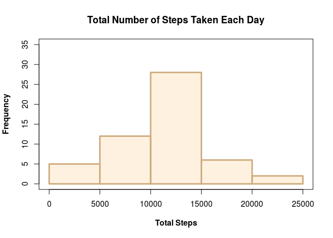
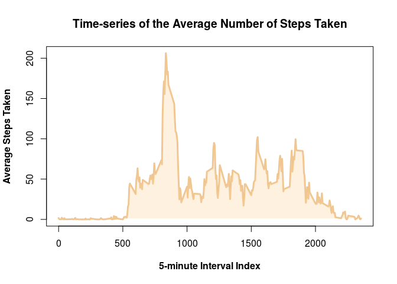
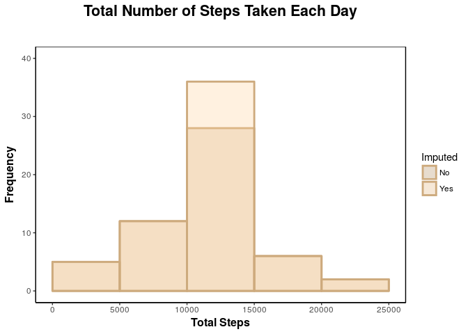

# Reproducible Research: Peer Assessment 1
Marcio Gualtieri  

## Installing the Required Packages

You might need to install the following packages if you don't already have them:


```r
install.packages("ktable")
install.packages("dplyr")
install.packages("Matrix")
install.packages("mice")
install.packages("ggplot2")
```

Just uncomment the packages you need and run this chunk before you run the remaining ones in this notebook.

## Importing the Required Packages

Once the libraries are installed, they need to be loaded as follows:


```r
suppressMessages(library(dplyr))   # Data frame manipulation
suppressMessages(library(scales))  # Color helpers
suppressMessages(library(mice))    # Data imputation
suppressMessages(library(ggplot2)) # Plotting
```

## Loading and preprocessing the data

### Downloading the Data-set Files


```r
download_zipped_data <- function(url, destination) {
  temp_file <- tempfile()
  download.file(url, temp_file)
  unzip(zipfile = temp_file, exdir = destination)
  unlink(temp_file)
}

download_zipped_data("https://d396qusza40orc.cloudfront.net/repdata%2Fdata%2Factivity.zip",
                     "./data")
```

Here's a list of files in the zip file:


```r
list.files(path = "./data", recursive = TRUE)
```

```
## [1] "activity.csv"
```

### Loading the Data-set


```r
activity <- read.csv("./data/activity.csv", stringsAsFactors = FALSE)
str(activity)
```

```
## 'data.frame':	17568 obs. of  3 variables:
##  $ steps   : int  NA NA NA NA NA NA NA NA NA NA ...
##  $ date    : chr  "2012-10-01" "2012-10-01" "2012-10-01" "2012-10-01" ...
##  $ interval: int  0 5 10 15 20 25 30 35 40 45 ...
```

### Sampling the Data-set


```r
sample_data_frame <- function(data, size) {
  sample_index <- sample(1:nrow(data), size)
  return(data[sample_index, ])
}

sample_data_frame(activity, 6)
```

<div class="kable-table">

         steps  date          interval
------  ------  -----------  ---------
1717         0  2012-10-06        2300
8772        15  2012-10-31        1055
15759       17  2012-11-24        1710
10029       NA  2012-11-04        1940
208         NA  2012-10-01        1715
15730      110  2012-11-24        1445

</div>

## What is mean total number of steps taken per day?

### Total Number of Steps per Day

1. Calculate the total number of steps taken per day


```r
total_steps_per_day <- na.omit(activity) %>% group_by(date) %>% summarize(total_steps = sum(steps))
total_steps_per_day
```

<div class="kable-table">

date          total_steps
-----------  ------------
2012-10-02            126
2012-10-03          11352
2012-10-04          12116
2012-10-05          13294
2012-10-06          15420
2012-10-07          11015
2012-10-09          12811
2012-10-10           9900
2012-10-11          10304
2012-10-12          17382
2012-10-13          12426
2012-10-14          15098
2012-10-15          10139
2012-10-16          15084
2012-10-17          13452
2012-10-18          10056
2012-10-19          11829
2012-10-20          10395
2012-10-21           8821
2012-10-22          13460
2012-10-23           8918
2012-10-24           8355
2012-10-25           2492
2012-10-26           6778
2012-10-27          10119
2012-10-28          11458
2012-10-29           5018
2012-10-30           9819
2012-10-31          15414
2012-11-02          10600
2012-11-03          10571
2012-11-05          10439
2012-11-06           8334
2012-11-07          12883
2012-11-08           3219
2012-11-11          12608
2012-11-12          10765
2012-11-13           7336
2012-11-15             41
2012-11-16           5441
2012-11-17          14339
2012-11-18          15110
2012-11-19           8841
2012-11-20           4472
2012-11-21          12787
2012-11-22          20427
2012-11-23          21194
2012-11-24          14478
2012-11-25          11834
2012-11-26          11162
2012-11-27          13646
2012-11-28          10183
2012-11-29           7047

</div>

### Histogram of the Total Steps per Day

2. If you do not understand the difference between a histogram and a barplot, research the difference between them. Make a histogram of the total number of steps taken each day.


```r
total_steps_per_day_hist <- function(data) {
    par(lwd = 3)
    hist(data$total_steps,
         main = "Total Number of Steps Taken Each Day",
         xlab ="Total Steps",
         ylim = c(0, 35),
         font.lab = 2,
         col = alpha("burlywood1", 0.3),
         border = "burlywood3")
    box(lwd = 1, lty = "solid")
}

total_steps_per_day_hist(total_steps_per_day)
```

<!-- -->

### Mean and Median of the Total Steps per Day

3. Calculate and report the mean and median of the total number of steps taken per day

Applying the mean and median functions over the total number of steps per day:


```r
mean_total_steps_per_day <- mean(total_steps_per_day$total_steps)
median_total_steps_per_day <- median(total_steps_per_day$total_steps)

mean_total_steps_per_day
```

```
## [1] 10766.19
```

```r
median_total_steps_per_day
```

```
## [1] 10765
```

The mean of the total number of steps each day is 10766.19 and the median is 10765.

## What is the average daily activity pattern?

### Time-series of the Average Steps

1. Make a time series plot (i.e. type = "l") of the 5-minute interval (x-axis) and the average number of steps taken, averaged across all days (y-axis).

First we need to compute the average number of steps per interval:


```r
average_steps_per_interval <- na.omit(activity) %>% group_by(interval) %>% summarize(average_steps = mean(steps))
average_steps_per_interval
```

<div class="kable-table">

 interval   average_steps
---------  --------------
        0       1.7169811
        5       0.3396226
       10       0.1320755
       15       0.1509434
       20       0.0754717
       25       2.0943396
       30       0.5283019
       35       0.8679245
       40       0.0000000
       45       1.4716981
       50       0.3018868
       55       0.1320755
      100       0.3207547
      105       0.6792453
      110       0.1509434
      115       0.3396226
      120       0.0000000
      125       1.1132075
      130       1.8301887
      135       0.1698113
      140       0.1698113
      145       0.3773585
      150       0.2641509
      155       0.0000000
      200       0.0000000
      205       0.0000000
      210       1.1320755
      215       0.0000000
      220       0.0000000
      225       0.1320755
      230       0.0000000
      235       0.2264151
      240       0.0000000
      245       0.0000000
      250       1.5471698
      255       0.9433962
      300       0.0000000
      305       0.0000000
      310       0.0000000
      315       0.0000000
      320       0.2075472
      325       0.6226415
      330       1.6226415
      335       0.5849057
      340       0.4905660
      345       0.0754717
      350       0.0000000
      355       0.0000000
      400       1.1886792
      405       0.9433962
      410       2.5660377
      415       0.0000000
      420       0.3396226
      425       0.3584906
      430       4.1132075
      435       0.6603774
      440       3.4905660
      445       0.8301887
      450       3.1132075
      455       1.1132075
      500       0.0000000
      505       1.5660377
      510       3.0000000
      515       2.2452830
      520       3.3207547
      525       2.9622642
      530       2.0943396
      535       6.0566038
      540      16.0188679
      545      18.3396226
      550      39.4528302
      555      44.4905660
      600      31.4905660
      605      49.2641509
      610      53.7735849
      615      63.4528302
      620      49.9622642
      625      47.0754717
      630      52.1509434
      635      39.3396226
      640      44.0188679
      645      44.1698113
      650      37.3584906
      655      49.0377358
      700      43.8113208
      705      44.3773585
      710      50.5094340
      715      54.5094340
      720      49.9245283
      725      50.9811321
      730      55.6792453
      735      44.3207547
      740      52.2641509
      745      69.5471698
      750      57.8490566
      755      56.1509434
      800      73.3773585
      805      68.2075472
      810     129.4339623
      815     157.5283019
      820     171.1509434
      825     155.3962264
      830     177.3018868
      835     206.1698113
      840     195.9245283
      845     179.5660377
      850     183.3962264
      855     167.0188679
      900     143.4528302
      905     124.0377358
      910     109.1132075
      915     108.1132075
      920     103.7169811
      925      95.9622642
      930      66.2075472
      935      45.2264151
      940      24.7924528
      945      38.7547170
      950      34.9811321
      955      21.0566038
     1000      40.5660377
     1005      26.9811321
     1010      42.4150943
     1015      52.6603774
     1020      38.9245283
     1025      50.7924528
     1030      44.2830189
     1035      37.4150943
     1040      34.6981132
     1045      28.3396226
     1050      25.0943396
     1055      31.9433962
     1100      31.3584906
     1105      29.6792453
     1110      21.3207547
     1115      25.5471698
     1120      28.3773585
     1125      26.4716981
     1130      33.4339623
     1135      49.9811321
     1140      42.0377358
     1145      44.6037736
     1150      46.0377358
     1155      59.1886792
     1200      63.8679245
     1205      87.6981132
     1210      94.8490566
     1215      92.7735849
     1220      63.3962264
     1225      50.1698113
     1230      54.4716981
     1235      32.4150943
     1240      26.5283019
     1245      37.7358491
     1250      45.0566038
     1255      67.2830189
     1300      42.3396226
     1305      39.8867925
     1310      43.2641509
     1315      40.9811321
     1320      46.2452830
     1325      56.4339623
     1330      42.7547170
     1335      25.1320755
     1340      39.9622642
     1345      53.5471698
     1350      47.3207547
     1355      60.8113208
     1400      55.7547170
     1405      51.9622642
     1410      43.5849057
     1415      48.6981132
     1420      35.4716981
     1425      37.5471698
     1430      41.8490566
     1435      27.5094340
     1440      17.1132075
     1445      26.0754717
     1450      43.6226415
     1455      43.7735849
     1500      30.0188679
     1505      36.0754717
     1510      35.4905660
     1515      38.8490566
     1520      45.9622642
     1525      47.7547170
     1530      48.1320755
     1535      65.3207547
     1540      82.9056604
     1545      98.6603774
     1550     102.1132075
     1555      83.9622642
     1600      62.1320755
     1605      64.1320755
     1610      74.5471698
     1615      63.1698113
     1620      56.9056604
     1625      59.7735849
     1630      43.8679245
     1635      38.5660377
     1640      44.6603774
     1645      45.4528302
     1650      46.2075472
     1655      43.6792453
     1700      46.6226415
     1705      56.3018868
     1710      50.7169811
     1715      61.2264151
     1720      72.7169811
     1725      78.9433962
     1730      68.9433962
     1735      59.6603774
     1740      75.0943396
     1745      56.5094340
     1750      34.7735849
     1755      37.4528302
     1800      40.6792453
     1805      58.0188679
     1810      74.6981132
     1815      85.3207547
     1820      59.2641509
     1825      67.7735849
     1830      77.6981132
     1835      74.2452830
     1840      85.3396226
     1845      99.4528302
     1850      86.5849057
     1855      85.6037736
     1900      84.8679245
     1905      77.8301887
     1910      58.0377358
     1915      53.3584906
     1920      36.3207547
     1925      20.7169811
     1930      27.3962264
     1935      40.0188679
     1940      30.2075472
     1945      25.5471698
     1950      45.6603774
     1955      33.5283019
     2000      19.6226415
     2005      19.0188679
     2010      19.3396226
     2015      33.3396226
     2020      26.8113208
     2025      21.1698113
     2030      27.3018868
     2035      21.3396226
     2040      19.5471698
     2045      21.3207547
     2050      32.3018868
     2055      20.1509434
     2100      15.9433962
     2105      17.2264151
     2110      23.4528302
     2115      19.2452830
     2120      12.4528302
     2125       8.0188679
     2130      14.6603774
     2135      16.3018868
     2140       8.6792453
     2145       7.7924528
     2150       8.1320755
     2155       2.6226415
     2200       1.4528302
     2205       3.6792453
     2210       4.8113208
     2215       8.5094340
     2220       7.0754717
     2225       8.6981132
     2230       9.7547170
     2235       2.2075472
     2240       0.3207547
     2245       0.1132075
     2250       1.6037736
     2255       4.6037736
     2300       3.3018868
     2305       2.8490566
     2310       0.0000000
     2315       0.8301887
     2320       0.9622642
     2325       1.5849057
     2330       2.6037736
     2335       4.6981132
     2340       3.3018868
     2345       0.6415094
     2350       0.2264151
     2355       1.0754717

</div>

Here's the time series for this data:


```r
with(average_steps_per_interval,
     plot(interval, average_steps, type = "l",
     main = "Time-series of the Average Number of Steps Taken",
     xlab ="5-minute Interval Index",
     ylab ="Average Steps Taken",
     font.lab = 2,
     col = "burlywood2",
     lwd = 3)
)

with(average_steps_per_interval,
     polygon(interval, average_steps, col = alpha("burlywood1", 0.3), border = NA)
)
```

<!-- -->

### Interval with Maximum Average Number of Steps

2. Which 5-minute interval, on average across all the days in the dataset, contains the maximum number of steps?


```r
maximum_number_steps <- slice(average_steps_per_interval, which.max(average_steps))
maximum_number_steps
```

<div class="kable-table">

 interval   average_steps
---------  --------------
      835        206.1698

</div>

The interval with index 835 contains the maximum average number of steps (206.1698).

## Imputing missing values

### Missing Values Report

1. Calculate and report the total number of missing values in the dataset (i.e. the total number of rows with NAs)


```r
na_summary <- function(data)
    data.frame(na_count = colSums(is.na(data)), na_fraction = colMeans(is.na(data)))

na_summary(activity)
```

<div class="kable-table">

            na_count   na_fraction
---------  ---------  ------------
steps           2304     0.1311475
date               0     0.0000000
interval           0     0.0000000

</div>

About 13% of the rows in the data-set have missing values. That's 2304 rows.  

### Imputation Method

2. Devise a strategy for filling in all of the missing values in the dataset. The strategy does not need to be sophisticated. For example, you could use the mean/median for that day, or the mean for that 5-minute interval, etc.

I'm going to use the [mice]() package to do imputation. The package offers the following imputation methods:


```r
suppressWarnings(methods(mice))
```

```
##  [1] mice.impute.2l.norm      mice.impute.2lonly.mean 
##  [3] mice.impute.2lonly.norm  mice.impute.2lonly.pmm  
##  [5] mice.impute.2l.pan       mice.impute.cart        
##  [7] mice.impute.fastpmm      mice.impute.lda         
##  [9] mice.impute.logreg       mice.impute.logreg.boot 
## [11] mice.impute.mean         mice.impute.midastouch  
## [13] mice.impute.norm         mice.impute.norm.boot   
## [15] mice.impute.norm.nob     mice.impute.norm.predict
## [17] mice.impute.passive      mice.impute.pmm         
## [19] mice.impute.polr         mice.impute.polyreg     
## [21] mice.impute.quadratic    mice.impute.rf          
## [23] mice.impute.ri           mice.impute.sample      
## [25] mice.mids                mice.theme              
## see '?methods' for accessing help and source code
```

But given that the specification asked for a "non-sophisticated method", we are going to use "mean" for imputation.


```r
imputation_model_fit <- mice(data = activity, method = "mean", printFlag = FALSE)
```

### New Imputed Data-set

3. Create a new dataset that is equal to the original dataset but with the missing data filled in.


```r
imputed_activity <- complete(imputation_model_fit)
na_summary(imputed_activity)
```

<div class="kable-table">

            na_count   na_fraction
---------  ---------  ------------
steps              0             0
date               0             0
interval           0             0

</div>

As expected, no `NA`'s to be found in the data-set.

### Histogram of the Total Steps per Day After Imputation

4. Make a histogram of the total number of steps taken each day and Calculate and report the mean and median total number of steps taken per day. Do these values differ from the estimates from the first part of the assignment? What is the impact of imputing missing data on the estimates of the total daily number of steps?

Let's compute the total steps per day for the imputed data:


```r
imputed_total_steps_per_day <- imputed_activity %>% group_by(date) %>% summarize(total_steps = sum(steps))
imputed_total_steps_per_day
```

<div class="kable-table">

date          total_steps
-----------  ------------
2012-10-01       10766.19
2012-10-02         126.00
2012-10-03       11352.00
2012-10-04       12116.00
2012-10-05       13294.00
2012-10-06       15420.00
2012-10-07       11015.00
2012-10-08       10766.19
2012-10-09       12811.00
2012-10-10        9900.00
2012-10-11       10304.00
2012-10-12       17382.00
2012-10-13       12426.00
2012-10-14       15098.00
2012-10-15       10139.00
2012-10-16       15084.00
2012-10-17       13452.00
2012-10-18       10056.00
2012-10-19       11829.00
2012-10-20       10395.00
2012-10-21        8821.00
2012-10-22       13460.00
2012-10-23        8918.00
2012-10-24        8355.00
2012-10-25        2492.00
2012-10-26        6778.00
2012-10-27       10119.00
2012-10-28       11458.00
2012-10-29        5018.00
2012-10-30        9819.00
2012-10-31       15414.00
2012-11-01       10766.19
2012-11-02       10600.00
2012-11-03       10571.00
2012-11-04       10766.19
2012-11-05       10439.00
2012-11-06        8334.00
2012-11-07       12883.00
2012-11-08        3219.00
2012-11-09       10766.19
2012-11-10       10766.19
2012-11-11       12608.00
2012-11-12       10765.00
2012-11-13        7336.00
2012-11-14       10766.19
2012-11-15          41.00
2012-11-16        5441.00
2012-11-17       14339.00
2012-11-18       15110.00
2012-11-19        8841.00
2012-11-20        4472.00
2012-11-21       12787.00
2012-11-22       20427.00
2012-11-23       21194.00
2012-11-24       14478.00
2012-11-25       11834.00
2012-11-26       11162.00
2012-11-27       13646.00
2012-11-28       10183.00
2012-11-29        7047.00
2012-11-30       10766.19

</div>

We can now compare the histograms for before and after the imputation:


```r
all_total_steps_per_day <-rbind(mutate(total_steps_per_day, Imputed = "No"), mutate(imputed_total_steps_per_day, Imputed = "Yes"))

ggplot(data = all_total_steps_per_day, aes(x = total_steps, fill = Imputed)) +
    geom_histogram(alpha = 0.3, binwidth = 5000, boundary = -5000, position = "identity", colour = "burlywood3", size = 1) +
    ggtitle("Total Number of Steps Taken Each Day") +
    xlab("Total Steps") +
    ylab("Frequency") +
    ylim(c(0, 40)) +
    scale_x_continuous(breaks = seq(from = 0, to = 25000, by = 5000)) +
    scale_fill_manual(values = c("burlywood3", "burlywood1")) +
    theme(plot.title = element_text(size = 16, face = "bold",
                                    hjust = 0.5, margin = margin(b = 30, unit = "pt"))) +
    theme(axis.title.x = element_text(size = 12, face="bold")) +
    theme(axis.title.y = element_text(size = 12, face="bold")) +
    theme(panel.background = element_blank(), axis.line = element_line(colour = "black")) +
    theme(panel.border = element_rect(colour = "black", fill = NA, size = 0.5))
```

<!-- -->

As expected, we see an increase on the frequency for the middle bin, which makes sense, given that we have imputed the missing data with the mean.


```r
mean_imputed_total_steps_per_day <- mean(imputed_total_steps_per_day$total_steps)
median_imputed_total_steps_per_day <- median(imputed_total_steps_per_day$total_steps)

mean_imputed_total_steps_per_day
```

```
## [1] 10766.19
```

```r
median_imputed_total_steps_per_day
```

```
## [1] 10766.19
```

The mean of the total number of steps each day after imputation is 10766.19 and the median is 10766.19.

The mean remained the same and the median is equal to the mean after the imputation.

## Are there differences in activity patterns between weekdays and weekends?

### Type of Day ("weekday" or "weekend")

1. Create a new factor variable in the dataset with two levels – “weekday” and “weekend” indicating whether a given date is a weekday or weekend day.


```r
to_weekday <- function(day)
    ifelse(weekdays(day) %in% c("Saturday", "Sunday"), "weekend", "weekday")

imputed_activity <- mutate(imputed_activity, day_type = to_weekday(as.Date(date)))
sample_data_frame(imputed_activity, 6)
```

<div class="kable-table">

         steps  date          interval  day_type 
------  ------  -----------  ---------  ---------
10834        0  2012-11-07        1445  weekday  
5930         0  2012-10-21        1405  weekend  
4735         0  2012-10-17        1030  weekday  
510          0  2012-10-02        1825  weekday  
10585       52  2012-11-06        1800  weekday  
6413         0  2012-10-23         620  weekday  

</div>

### Time-series of the Average Steps per Type of Day

2. Make a panel plot containing a time series plot (i.e. type = "l") of the 5-minute interval (x-axis) and the average number of steps taken, averaged across all weekday days or weekend days (y-axis). See the README file in the GitHub repository to see an example of what this plot should look like using simulated data.

As earlier, first we need to compute the average number of steps per interval:


```r
imputed_average_steps_per_interval <- imputed_activity %>% group_by(interval, day_type) %>% summarize(average_steps = mean(steps))
imputed_average_steps_per_interval
```

<div class="kable-table">

 interval  day_type    average_steps
---------  ---------  --------------
        0  weekday          7.006569
        0  weekend          4.672825
        5  weekday          5.384347
        5  weekend          4.672825
       10  weekday          5.139902
       10  weekend          4.672825
       15  weekday          5.162124
       15  weekend          4.672825
       20  weekday          5.073236
       20  weekend          4.672825
       25  weekday          6.295458
       25  weekend          7.922825
       30  weekday          5.606569
       30  weekend          4.672825
       35  weekday          6.006569
       35  weekend          4.672825
       40  weekday          4.984347
       40  weekend          4.672825
       45  weekday          6.584347
       45  weekend          5.047825
       50  weekday          5.339902
       50  weekend          4.672825
       55  weekday          4.984347
       55  weekend          5.110325
      100  weekday          5.362124
      100  weekend          4.672825
      105  weekday          4.984347
      105  weekend          6.922825
      110  weekday          5.162124
      110  weekend          4.672825
      115  weekday          5.384347
      115  weekend          4.672825
      120  weekday          4.984347
      120  weekend          4.672825
      125  weekday          6.295458
      125  weekend          4.672825
      130  weekday          6.962124
      130  weekend          5.172825
      135  weekday          4.984347
      135  weekend          5.235325
      140  weekday          5.184347
      140  weekend          4.672825
      145  weekday          5.184347
      145  weekend          5.360325
      150  weekday          5.295458
      150  weekend          4.672825
      155  weekday          4.984347
      155  weekend          4.672825
      200  weekday          4.984347
      200  weekend          4.672825
      205  weekday          4.984347
      205  weekend          4.672825
      210  weekday          6.228791
      210  weekend          4.922825
      215  weekday          4.984347
      215  weekend          4.672825
      220  weekday          4.984347
      220  weekend          4.672825
      225  weekday          5.139902
      225  weekend          4.672825
      230  weekday          4.984347
      230  weekend          4.672825
      235  weekday          5.251013
      235  weekend          4.672825
      240  weekday          4.984347
      240  weekend          4.672825
      245  weekday          4.984347
      245  weekend          4.672825
      250  weekday          6.806569
      250  weekend          4.672825
      255  weekday          6.095458
      255  weekend          4.672825
      300  weekday          4.984347
      300  weekend          4.672825
      305  weekday          4.984347
      305  weekend          4.672825
      310  weekday          4.984347
      310  weekend          4.672825
      315  weekday          4.984347
      315  weekend          4.672825
      320  weekday          4.984347
      320  weekend          5.360325
      325  weekday          5.717680
      325  weekend          4.672825
      330  weekday          6.006569
      330  weekend          7.172825
      335  weekday          5.428791
      335  weekend          5.360325
      340  weekday          5.339902
      340  weekend          5.297825
      345  weekday          5.073236
      345  weekend          4.672825
      350  weekday          4.984347
      350  weekend          4.672825
      355  weekday          4.984347
      355  weekend          4.672825
      400  weekday          5.095458
      400  weekend          8.297825
      405  weekday          6.095458
      405  weekend          4.672825
      410  weekday          6.873235
      410  weekend          7.860325
      415  weekday          4.984347
      415  weekend          4.672825
      420  weekday          5.384347
      420  weekend          4.672825
      425  weekday          4.984347
      425  weekend          5.860325
      430  weekday          7.806569
      430  weekend         10.360325
      435  weekday          5.117680
      435  weekend          6.485325
      440  weekday          8.295458
      440  weekend          6.922825
      445  weekday          5.762124
      445  weekend          5.235325
      450  weekday          6.917680
      450  weekend          9.547825
      455  weekday          5.562124
      455  weekend          6.735325
      500  weekday          4.984347
      500  weekend          4.672825
      505  weekday          6.828791
      505  weekend          4.672825
      510  weekday          8.517680
      510  weekend          4.672825
      515  weekday          6.873235
      515  weekend          6.797825
      520  weekday          8.762124
      520  weekend          5.047825
      525  weekday          7.295458
      525  weekend          7.985325
      530  weekday          7.451013
      530  weekend          4.672825
      535  weekday         12.117680
      535  weekend          4.672825
      540  weekday         23.251013
      540  weekend          6.360325
      545  weekday         26.184347
      545  weekend          5.797825
      550  weekday         50.073236
      550  weekend          8.547825
      555  weekday         55.317680
      555  weekend         10.485325
      600  weekday         42.073236
      600  weekend          4.672825
      605  weekday         63.006569
      605  weekend          4.672825
      610  weekday         67.895458
      610  weekend          5.860325
      615  weekday         73.673236
      615  weekend         21.672825
      620  weekday         62.251013
      620  weekend          9.110325
      625  weekday         58.739902
      625  weekend          9.422825
      630  weekday         64.473236
      630  weekend         10.110325
      635  weekday         47.717680
      635  weekend         14.797825
      640  weekday         54.784347
      640  weekend         10.422825
      645  weekday         53.962124
      645  weekend         13.235325
      650  weekday         47.051013
      650  weekend         10.110325
      655  weekday         58.873235
      655  weekend         15.547825
      700  weekday         49.739902
      700  weekend         23.922825
      705  weekday         49.895458
      705  weekend         25.360325
      710  weekday         60.273235
      710  weekend         16.485325
      715  weekday         67.051013
      715  weekend         10.672825
      720  weekday         61.428791
      720  weekend         11.297825
      725  weekday         57.295458
      725  weekend         26.422825
      730  weekday         63.784347
      730  weekend         23.735325
      735  weekday         53.428791
      735  weekend         15.235325
      740  weekday         60.739902
      740  weekend         20.985325
      745  weekday         79.095458
      745  weekend         26.610325
      750  weekday         65.006569
      750  weekend         27.485325
      755  weekday         64.073235
      755  weekend         24.485325
      800  weekday         77.917680
      800  weekend         42.610325
      805  weekday         67.851013
      805  weekend         53.797825
      810  weekday        131.739902
      810  weekend         76.922825
      815  weekday        165.962124
      815  weekend         73.735325
      820  weekday        182.739902
      820  weekend         71.672825
      825  weekday        167.873235
      825  weekend         61.297825
      830  weekday        180.228791
      830  weekend         99.110325
      835  weekday        207.873235
      835  weekend        116.985325
      840  weekday        197.762124
      840  weekend        111.485325
      845  weekday        166.695458
      845  weekend        144.672825
      850  weekday        171.762124
      850  weekend        143.110325
      855  weekday        159.806569
      855  weekend        122.485325
      900  weekday        153.517680
      900  weekend         62.110325
      905  weekday        114.228791
      905  weekend        108.297825
      910  weekday         84.384347
      910  weekend        142.797825
      915  weekday         77.873236
      915  weekend        157.797825
      920  weekday         94.695458
      920  weekend         95.922825
      925  weekday         84.651013
      925  weekend         98.485325
      930  weekday         54.673235
      930  weekend         84.235325
      935  weekday         34.806569
      935  weekend         70.610325
      940  weekday         29.139902
      940  weekend         18.860325
      945  weekday         40.673235
      945  weekend         32.672825
      950  weekday         39.451013
      950  weekend         23.610325
      955  weekday         19.806569
      955  weekend         32.735325
     1000  weekday         37.451013
     1000  weekend         47.735325
     1005  weekday         19.606569
     1005  weekend         52.922825
     1010  weekday         38.406569
     1010  weekend         51.172825
     1015  weekday         45.784347
     1015  weekend         64.360325
     1020  weekday         30.139902
     1020  weekend         62.860325
     1025  weekday         33.362124
     1025  weekend         93.110325
     1030  weekday         32.206569
     1030  weekend         74.797825
     1035  weekday         24.251013
     1035  weekend         74.422825
     1040  weekday         23.873235
     1040  weekend         66.485325
     1045  weekday         27.117680
     1045  weekend         36.297825
     1050  weekday         23.673236
     1050  weekend         35.235325
     1055  weekday         23.984347
     1055  weekend         57.047825
     1100  weekday         22.495458
     1100  weekend         59.297825
     1105  weekday         26.117680
     1105  weekend         43.547825
     1110  weekday         13.828791
     1110  weekend         50.422825
     1115  weekday         17.851013
     1115  weekend         53.110325
     1120  weekday         25.384347
     1120  weekend         41.297825
     1125  weekday         25.184347
     1125  weekend         35.547825
     1130  weekday         33.295458
     1130  weekend         35.797825
     1135  weekday         48.517680
     1135  weekend         47.797825
     1140  weekday         43.939902
     1140  weekend         34.360325
     1145  weekday         46.962124
     1145  weekend         34.360325
     1150  weekday         48.962124
     1150  weekend         33.485325
     1155  weekday         53.228791
     1155  weekend         65.047825
     1200  weekday         52.184347
     1200  weekend         83.485325
     1205  weekday         66.139902
     1205  weekend        123.172825
     1210  weekday         75.984347
     1210  weekend        119.172825
     1215  weekday         67.895458
     1215  weekend        135.047825
     1220  weekday         45.251013
     1220  weekend        101.422825
     1225  weekday         45.117680
     1225  weekend         57.985325
     1230  weekday         60.295458
     1230  weekend         29.547825
     1235  weekday         31.406569
     1235  weekend         37.735325
     1240  weekday         23.428791
     1240  weekend         40.672825
     1245  weekday         29.273235
     1245  weekend         61.360325
     1250  weekday         31.762124
     1250  weekend         78.610325
     1255  weekday         52.606569
     1255  weekend         93.610325
     1300  weekday         23.939902
     1300  weekend         91.610325
     1305  weekday         25.406569
     1305  weekend         79.360325
     1310  weekday         23.784347
     1310  weekend         95.110325
     1315  weekday         15.162124
     1315  weekend        111.797825
     1320  weekday         34.451013
     1320  weekend         74.985325
     1325  weekday         42.317680
     1325  weekend         86.610325
     1330  weekday         31.051013
     1330  weekend         72.985325
     1335  weekday         24.939902
     1335  weekend         31.797825
     1340  weekday         24.895458
     1340  weekend         81.047825
     1345  weekday         38.028791
     1345  weekend         89.110325
     1350  weekday         24.251013
     1350  weekend        107.235325
     1355  weekday         33.206569
     1355  weekend        126.735325
     1400  weekday         44.473236
     1400  weekend         78.297825
     1405  weekday         37.606569
     1405  weekend         85.047825
     1410  weekday         31.295458
     1410  weekend         75.047825
     1415  weekday         43.539902
     1415  weekend         57.547825
     1420  weekday         27.739902
     1420  weekend         58.172825
     1425  weekday         30.739902
     1425  weekend         56.610325
     1430  weekday         30.895458
     1430  weekend         70.422825
     1435  weekday         15.828791
     1435  weekend         65.297825
     1440  weekday         14.251013
     1440  weekend         35.297825
     1445  weekday         23.495458
     1445  weekend         38.985325
     1450  weekday         41.028791
     1450  weekend         47.797825
     1455  weekday         37.428791
     1455  weekend         58.422825
     1500  weekday         31.851013
     1500  weekend         28.547825
     1505  weekday         35.228791
     1505  weekend         39.110325
     1510  weekday         30.206569
     1510  weekend         51.297825
     1515  weekday         31.717680
     1515  weekend         58.172825
     1520  weekday         38.717680
     1520  weekend         62.047825
     1525  weekday         35.962124
     1525  weekend         75.735325
     1530  weekday         40.695458
     1530  weekend         63.672825
     1535  weekday         47.206569
     1535  weekend        102.297825
     1540  weekday         84.495458
     1540  weekend         55.672825
     1545  weekday         87.695458
     1545  weekend         98.860325
     1550  weekday         85.317680
     1550  weekend        116.985325
     1555  weekday         64.095458
     1555  weekend        116.547825
     1600  weekday         43.584347
     1600  weekend        101.922825
     1605  weekday         41.628791
     1605  weekend        114.047825
     1610  weekday         51.651013
     1610  weekend        120.360325
     1615  weekday         32.695458
     1615  weekend        135.985325
     1620  weekday         24.206569
     1620  weekend        139.110325
     1625  weekday         26.539902
     1625  weekend        142.047825
     1630  weekday         21.651013
     1630  weekend        103.110325
     1635  weekday         21.673236
     1635  weekend         85.485325
     1640  weekday         24.895458
     1640  weekend         96.610325
     1645  weekday         30.917680
     1645  weekend         82.297825
     1650  weekday         26.451013
     1650  weekend         97.360325
     1655  weekday         31.584347
     1655  weekend         74.547825
     1700  weekday         22.339902
     1700  weekend        110.297825
     1705  weekday         42.428791
     1705  weekend         85.860325
     1710  weekday         32.406569
     1710  weekend         95.547825
     1715  weekday         44.895458
     1715  weekend         95.235325
     1720  weekday         55.406569
     1720  weekend        103.735325
     1725  weekday         66.828791
     1725  weekend         92.235325
     1730  weekday         51.939902
     1730  weekend        100.985325
     1735  weekday         62.851013
     1735  weekend         39.547825
     1740  weekday         77.851013
     1740  weekend         48.485325
     1745  weekday         56.784347
     1745  weekend         46.172825
     1750  weekday         34.851013
     1750  weekend         35.860325
     1755  weekday         37.584347
     1755  weekend         37.047825
     1800  weekday         26.206569
     1800  weekend         79.735325
     1805  weekday         43.873235
     1805  weekend         87.485325
     1810  weekday         62.251013
     1810  weekend         91.047825
     1815  weekday         76.251013
     1815  weekend         86.860325
     1820  weekday         58.473236
     1820  weekend         50.547825
     1825  weekday         69.406569
     1825  weekend         47.985325
     1830  weekday         73.851013
     1830  weekend         68.360325
     1835  weekday         76.584347
     1835  weekend         49.235325
     1840  weekday         85.317680
     1840  weekend         61.422825
     1845  weekday        107.184347
     1845  weekend         46.672825
     1850  weekday         94.739902
     1850  weekend         39.047825
     1855  weekday         84.162124
     1855  weekend         65.547825
     1900  weekday         81.228791
     1900  weekend         71.360325
     1905  weekday         71.828791
     1905  weekend         74.485325
     1910  weekday         59.628791
     1910  weekend         43.235325
     1915  weekday         52.251013
     1915  weekend         48.485325
     1920  weekday         38.028791
     1920  weekend         32.047825
     1925  weekday         22.784347
     1925  weekend         23.235325
     1930  weekday         30.428791
     1930  weekend         23.860325
     1935  weekday         45.628791
     1935  weekend         22.922825
     1940  weekday         31.006569
     1940  weekend         31.547825
     1945  weekday         20.162124
     1945  weekend         46.610325
     1950  weekday         43.162124
     1950  weekend         48.547825
     1955  weekday         27.806569
     1955  weekend         51.547825
     2000  weekday         15.762124
     2000  weekend         39.360325
     2005  weekday          8.006569
     2005  weekend         59.172825
     2010  weekday          9.228791
     2010  weekend         56.797825
     2015  weekday         14.651013
     2015  weekend         87.922825
     2020  weekday         10.117680
     2020  weekend         79.047825
     2025  weekday          7.873235
     2025  weekend         66.672825
     2030  weekday         11.117680
     2030  weekend         77.860325
     2035  weekday          9.295458
     2035  weekend         63.235325
     2040  weekday         11.339902
     2040  weekend         51.547825
     2045  weekday         15.251013
     2045  weekend         46.422825
     2050  weekday         26.651013
     2050  weekend         50.735325
     2055  weekday         19.606569
     2055  weekend         30.297825
     2100  weekday         14.228791
     2100  weekend         31.485325
     2105  weekday         21.584347
     2105  weekend         15.047825
     2110  weekday         30.362124
     2110  weekend         10.985325
     2115  weekday         21.362124
     2115  weekend         22.360325
     2120  weekday         17.606569
     2120  weekend         10.422825
     2125  weekday         11.962124
     2125  weekend         11.610325
     2130  weekday         15.828791
     2130  weekend         22.735325
     2135  weekday         19.317680
     2135  weekend         18.360325
     2140  weekday         10.962124
     2140  weekend         16.610325
     2145  weekday         11.539902
     2145  weekend         12.047825
     2150  weekday         12.162124
     2150  weekend         11.422825
     2155  weekday          8.073235
     2155  weekend          4.672825
     2200  weekday          6.317680
     2200  weekend          5.735325
     2205  weekday          8.917680
     2205  weekend          5.797825
     2210  weekday         10.651013
     2210  weekend          4.672825
     2215  weekday         15.006569
     2215  weekend          4.672825
     2220  weekday         13.317680
     2220  weekend          4.672825
     2225  weekday         14.673236
     2225  weekend          6.235325
     2230  weekday         16.473236
     2230  weekend          4.672825
     2235  weekday          7.584347
     2235  weekend          4.672825
     2240  weekday          4.984347
     2240  weekend          5.735325
     2245  weekday          5.117680
     2245  weekend          4.672825
     2250  weekday          6.673235
     2250  weekend          5.235325
     2255  weekday          6.384347
     2255  weekend         15.985325
     2300  weekday          8.095458
     2300  weekend          6.860325
     2305  weekday          8.339902
     2305  weekend          4.672825
     2310  weekday          4.984347
     2310  weekend          4.672825
     2315  weekday          5.962124
     2315  weekend          4.672825
     2320  weekday          6.117680
     2320  weekend          4.672825
     2325  weekday          6.651013
     2325  weekend          5.235325
     2330  weekday          7.673235
     2330  weekend          5.735325
     2335  weekday          6.606569
     2335  weekend         15.672825
     2340  weekday          6.784347
     2340  weekend         10.547825
     2345  weekday          5.162124
     2345  weekend          6.297825
     2350  weekday          5.251013
     2350  weekend          4.672825
     2355  weekday          6.251013
     2355  weekend          4.672825

</div>

Here's the time series for this data broken by weekday:


```r
ggplot(imputed_average_steps_per_interval, aes(x = interval, y = average_steps)) +
    geom_area(colour = "burlywood2", fill = "burlywood1", size = 1, alpha = 0.3) +
    ggtitle("Time-series of the Average Number of Steps Taken") +
    xlab("5-minute Interval Index") +
    ylab("Average Steps Taken") +
    facet_wrap(~ day_type, ncol = 1) +
    theme(plot.title = element_text(size = 16, face = "bold",
                                    hjust = 0.5, margin = margin(b = 30, unit = "pt"))) +
    theme(axis.title.x = element_text(size = 12, face="bold")) +
    theme(axis.title.y = element_text(size = 12, face="bold")) +
    theme(panel.background = element_blank(), axis.line = element_line(colour = "black")) +
    theme(panel.border = element_rect(colour = "black", fill = NA, size = 0.5)) +
    theme(strip.background = element_rect(fill = alpha("burlywood3", 0.3), color = "black", size = 0.5))
```

<!-- -->

The activity patterns indeed look different: On weekdays the activity seems more concentrated at the beginning of the day, while during weekends seems more distributed along the day.
