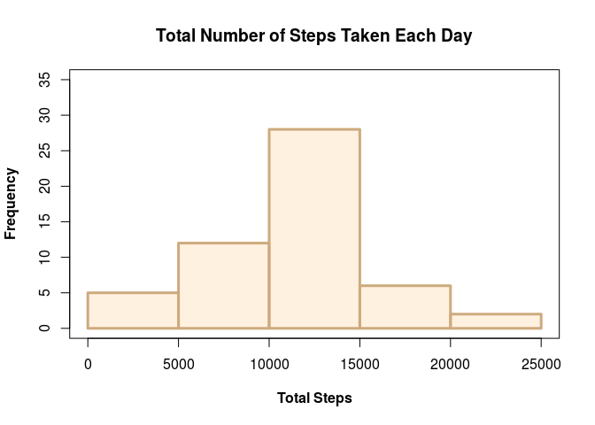
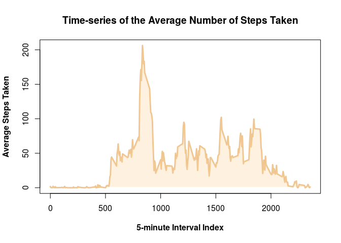
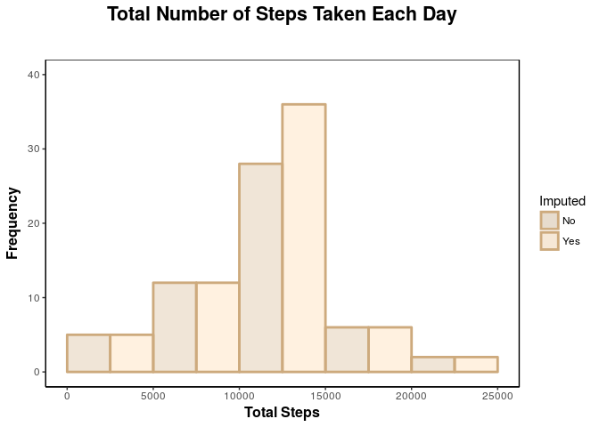
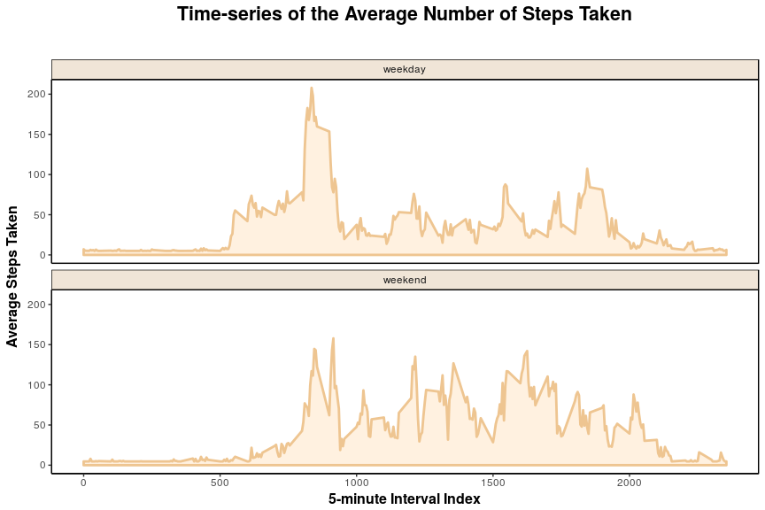

-   [Installing the Required Packages](#installing-the-required-packages)
-   [Importing the Required Packages](#importing-the-required-packages)
-   [Loading the data](#loading-the-data)
    -   [Downloading the Data-set Files](#downloading-the-data-set-files)
    -   [Loading the Data-set](#loading-the-data-set)
    -   [Sampling the Data-set](#sampling-the-data-set)
-   [What is mean total number of steps taken per day?](#what-is-mean-total-number-of-steps-taken-per-day)
    -   [Total Number of Steps per Day](#total-number-of-steps-per-day)
    -   [Histogram of the Total Steps per Day](#histogram-of-the-total-steps-per-day)
    -   [Mean and Median of the Total Steps per Day](#mean-and-median-of-the-total-steps-per-day)
-   [What is the average daily activity pattern?](#what-is-the-average-daily-activity-pattern)
    -   [Time-series of the Average Steps](#time-series-of-the-average-steps)
    -   [Interval with Maximum Average Number of Steps](#interval-with-maximum-average-number-of-steps)
-   [Imputing missing values](#imputing-missing-values)
    -   [Missing Values Report](#missing-values-report)
    -   [Imputation Method](#imputation-method)
    -   [New Imputed Data-set](#new-imputed-data-set)
    -   [Histogram of the Total Steps per Day After Imputation](#histogram-of-the-total-steps-per-day-after-imputation)
-   [Are there differences in activity patterns between weekdays and weekends?](#are-there-differences-in-activity-patterns-between-weekdays-and-weekends)
    -   [Type of Day ("weekday" or "weekend")](#type-of-day-weekday-or-weekend)
    -   [Time-series of the Average Steps per Type of Day](#time-series-of-the-average-steps-per-type-of-day)

Installing the Required Packages
--------------------------------

You might need to install the following packages if you don't already have them:

``` r
install.packages("ktable")
install.packages("dplyr")
install.packages("Matrix")
install.packages("mice")
install.packages("ggplot2")
```

Just uncomment the packages you need and run this chunk before you run the remaining ones in this notebook.

Importing the Required Packages
-------------------------------

Once the libraries are installed, they need to be loaded as follows:

``` r
suppressMessages(library(dplyr))   # Data frame manipulation
suppressMessages(library(scales))  # Color helpers
suppressMessages(library(mice))    # Data imputation
suppressMessages(library(ggplot2)) # Plotting
```

Loading the data
----------------

### Downloading the Data-set Files

``` r
download_zipped_data <- function(url, destination) {
  temp_file <- tempfile()
  download.file(url, temp_file)
  unzip(zipfile = temp_file, exdir = destination)
  unlink(temp_file)
}

download_zipped_data("https://d396qusza40orc.cloudfront.net/repdata%2Fdata%2Factivity.zip",
                     "./data")
```

Here's a list of files in the zip file:

``` r
list.files(path = "./data", recursive = TRUE)
```

    ## [1] "activity.csv"

### Loading the Data-set

``` r
activity <- read.csv("./data/activity.csv", stringsAsFactors = FALSE)
str(activity)
```

    ## 'data.frame':    17568 obs. of  3 variables:
    ##  $ steps   : int  NA NA NA NA NA NA NA NA NA NA ...
    ##  $ date    : chr  "2012-10-01" "2012-10-01" "2012-10-01" "2012-10-01" ...
    ##  $ interval: int  0 5 10 15 20 25 30 35 40 45 ...

### Sampling the Data-set

``` r
sample_data_frame <- function(data, size) {
  sample_index <- sample(1:nrow(data), size)
  return(data[sample_index, ])
}

sample_data_frame(activity, 6)
```

|       |  steps| date       |  interval|
|-------|------:|:-----------|---------:|
| 3435  |      0| 2012-10-12 |      2210|
| 14205 |    546| 2012-11-19 |       740|
| 16346 |     38| 2012-11-26 |      1805|
| 10966 |      0| 2012-11-08 |       145|
| 4475  |     21| 2012-10-16 |      1250|
| 2315  |      0| 2012-10-09 |        50|

What is mean total number of steps taken per day?
-------------------------------------------------

### Total Number of Steps per Day

1.  Calculate the total number of steps taken per day

``` r
total_steps_per_day <- na.omit(activity) %>% group_by(date) %>% summarize(total_steps = sum(steps))
sample_data_frame(total_steps_per_day, 6)
```

| date       |  total\_steps|
|:-----------|-------------:|
| 2012-11-07 |         12883|
| 2012-10-23 |          8918|
| 2012-11-05 |         10439|
| 2012-10-07 |         11015|
| 2012-10-09 |         12811|
| 2012-11-29 |          7047|

### Histogram of the Total Steps per Day

1.  If you do not understand the difference between a histogram and a barplot, research the difference between them. Make a histogram of the total number of steps taken each day.

``` r
total_steps_per_day_hist <- function(data) {
    par(lwd = 3)
    hist(data$total_steps,
         main = "Total Number of Steps Taken Each Day",
         xlab ="Total Steps",
         ylim = c(0, 35),
         font.lab = 2,
         col = alpha("burlywood1", 0.3),
         border = "burlywood3")
    box(lwd = 1, lty = "solid")
}

total_steps_per_day_hist(total_steps_per_day)
```



### Mean and Median of the Total Steps per Day

1.  Calculate and report the mean and median of the total number of steps taken per day

Applying the mean and median functions over the total number of steps per day:

``` r
mean_total_steps_per_day <- mean(total_steps_per_day$total_steps)
median_total_steps_per_day <- median(total_steps_per_day$total_steps)

mean_total_steps_per_day
```

    ## [1] 10766.19

``` r
median_total_steps_per_day
```

    ## [1] 10765

The mean of the total number of steps each day is 10766.19 and the median is 10765.

What is the average daily activity pattern?
-------------------------------------------

### Time-series of the Average Steps

1.  Make a time series plot (i.e. type = "l") of the 5-minute interval (x-axis) and the average number of steps taken, averaged across all days (y-axis).

First we need to compute the average number of steps per interval:

``` r
average_steps_per_interval <- na.omit(activity) %>% group_by(interval) %>% summarize(average_steps = mean(steps))
sample_data_frame(average_steps_per_interval, 6)
```

|  interval|  average\_steps|
|---------:|---------------:|
|      2140|        8.679245|
|      2125|        8.018868|
|      1640|       44.660377|
|       810|      129.433962|
|      1415|       48.698113|
|      1950|       45.660377|

Here's the time series for this data:

``` r
with(average_steps_per_interval,
     plot(interval, average_steps, type = "l",
     main = "Time-series of the Average Number of Steps Taken",
     xlab ="5-minute Interval Index",
     ylab ="Average Steps Taken",
     font.lab = 2,
     col = "burlywood2",
     lwd = 3)
)

with(average_steps_per_interval,
     polygon(interval, average_steps, col = alpha("burlywood1", 0.3), border = NA)
)
```



### Interval with Maximum Average Number of Steps

1.  Which 5-minute interval, on average across all the days in the dataset, contains the maximum number of steps?

``` r
maximum_number_steps <- slice(average_steps_per_interval, which.max(average_steps))
maximum_number_steps
```

|  interval|  average\_steps|
|---------:|---------------:|
|       835|        206.1698|

The interval with index 835 contains the maximum average number of steps (206.1698).

Imputing missing values
-----------------------

### Missing Values Report

1.  Calculate and report the total number of missing values in the dataset (i.e. the total number of rows with NAs)

``` r
na_summary <- function(data)
    data.frame(na_count = colSums(is.na(data)), na_fraction = colMeans(is.na(data)))

na_summary(activity)
```

|          |  na\_count|  na\_fraction|
|----------|----------:|-------------:|
| steps    |       2304|     0.1311475|
| date     |          0|     0.0000000|
| interval |          0|     0.0000000|

About 13% of the rows in the data-set have missing values. That's 2304 rows.

### Imputation Method

1.  Devise a strategy for filling in all of the missing values in the dataset. The strategy does not need to be sophisticated. For example, you could use the mean/median for that day, or the mean for that 5-minute interval, etc.

I'm going to use the [mice]() package to do imputation. The package offers the following imputation methods:

``` r
suppressWarnings(methods(mice))
```

    ##  [1] mice.impute.2l.norm      mice.impute.2lonly.mean 
    ##  [3] mice.impute.2lonly.norm  mice.impute.2lonly.pmm  
    ##  [5] mice.impute.2l.pan       mice.impute.cart        
    ##  [7] mice.impute.fastpmm      mice.impute.lda         
    ##  [9] mice.impute.logreg       mice.impute.logreg.boot 
    ## [11] mice.impute.mean         mice.impute.midastouch  
    ## [13] mice.impute.norm         mice.impute.norm.boot   
    ## [15] mice.impute.norm.nob     mice.impute.norm.predict
    ## [17] mice.impute.passive      mice.impute.pmm         
    ## [19] mice.impute.polr         mice.impute.polyreg     
    ## [21] mice.impute.quadratic    mice.impute.rf          
    ## [23] mice.impute.ri           mice.impute.sample      
    ## [25] mice.mids                mice.theme              
    ## see '?methods' for accessing help and source code

But given that the specification asked for a "non-sophisticated method", we are going to use "mean" for imputation.

``` r
imputation_model_fit <- mice(data = activity, method = "mean", printFlag = FALSE)
```

### New Imputed Data-set

1.  Create a new dataset that is equal to the original dataset but with the missing data filled in.

``` r
imputed_activity <- complete(imputation_model_fit)
na_summary(imputed_activity)
```

|          |  na\_count|  na\_fraction|
|----------|----------:|-------------:|
| steps    |          0|             0|
| date     |          0|             0|
| interval |          0|             0|

As expected, no `NA`'s to be found in the data-set.

### Histogram of the Total Steps per Day After Imputation

1.  Make a histogram of the total number of steps taken each day and Calculate and report the mean and median total number of steps taken per day. Do these values differ from the estimates from the first part of the assignment? What is the impact of imputing missing data on the estimates of the total daily number of steps?

Let's compute the total steps per day for the imputed data:

``` r
imputed_total_steps_per_day <- imputed_activity %>% group_by(date) %>% summarize(total_steps = sum(steps))
sample_data_frame(imputed_total_steps_per_day, 6)
```

| date       |  total\_steps|
|:-----------|-------------:|
| 2012-11-26 |         11162|
| 2012-11-17 |         14339|
| 2012-11-12 |         10765|
| 2012-11-13 |          7336|
| 2012-10-30 |          9819|
| 2012-10-19 |         11829|

We can now compare the histograms for before and after the imputation:

``` r
all_total_steps_per_day <-rbind(mutate(total_steps_per_day, Imputed = "No"), mutate(imputed_total_steps_per_day, Imputed = "Yes"))

ggplot(data = all_total_steps_per_day, aes(x = total_steps, fill = Imputed)) +
    geom_histogram(alpha = 0.3, binwidth = 5000, boundary = -5000, position = "identity", colour = "burlywood3", size = 1) +
    ggtitle("Total Number of Steps Taken Each Day") +
    xlab("Total Steps") +
    ylab("Frequency") +
    ylim(c(0, 40)) +
    scale_x_continuous(breaks = seq(from = 0, to = 25000, by = 5000)) +
    scale_fill_manual(values = c("burlywood3", "burlywood1")) +
    theme(plot.title = element_text(size = 16, face = "bold",
                                    hjust = 0.5, margin = margin(b = 30, unit = "pt"))) +
    theme(axis.title.x = element_text(size = 12, face="bold")) +
    theme(axis.title.y = element_text(size = 12, face="bold")) +
    theme(panel.background = element_blank(), axis.line = element_line(colour = "black")) +
    theme(panel.border = element_rect(colour = "black", fill = NA, size = 0.5))
```



As expected, we see an increase on the frequency for the middle bin, which makes sense, given that we have imputed the missing data with the mean.

``` r
mean_imputed_total_steps_per_day <- mean(imputed_total_steps_per_day$total_steps)
median_imputed_total_steps_per_day <- median(imputed_total_steps_per_day$total_steps)

mean_imputed_total_steps_per_day
```

    ## [1] 10766.19

``` r
median_imputed_total_steps_per_day
```

    ## [1] 10766.19

The mean of the total number of steps each day after imputation is 10766.19 and the median is 10766.19.

The mean remained the same and the median is equal to the mean after the imputation.

Are there differences in activity patterns between weekdays and weekends?
-------------------------------------------------------------------------

### Type of Day ("weekday" or "weekend")

1.  Create a new factor variable in the dataset with two levels – “weekday” and “weekend” indicating whether a given date is a weekday or weekend day.

``` r
to_weekday <- function(day)
    ifelse(weekdays(day) %in% c("Saturday", "Sunday"), "weekend", "weekday")

imputed_activity <- mutate(imputed_activity, day_type = to_weekday(as.Date(date)))
sample_data_frame(imputed_activity, 6)
```

|       |  steps| date       |  interval| day\_type |
|-------|------:|:-----------|---------:|:----------|
| 16646 |     83| 2012-11-27 |      1905| weekday   |
| 1848  |    207| 2012-10-07 |       955| weekend   |
| 13729 |      0| 2012-11-17 |      1600| weekend   |
| 7412  |      0| 2012-10-26 |      1735| weekday   |
| 15145 |     21| 2012-11-22 |      1400| weekday   |
| 12531 |     16| 2012-11-13 |      1210| weekday   |

### Time-series of the Average Steps per Type of Day

1.  Make a panel plot containing a time series plot (i.e. type = "l") of the 5-minute interval (x-axis) and the average number of steps taken, averaged across all weekday days or weekend days (y-axis). See the README file in the GitHub repository to see an example of what this plot should look like using simulated data.

As earlier, first we need to compute the average number of steps per interval:

``` r
imputed_average_steps_per_interval <- imputed_activity %>% group_by(interval, day_type) %>% summarize(average_steps = mean(steps))
imputed_average_steps_per_interval <- mutate(imputed_average_steps_per_interval, day_type = as.factor(day_type))
sample_data_frame(imputed_average_steps_per_interval, 6)
```

|  interval| day\_type |  average\_steps|
|---------:|:----------|---------------:|
|      1610| weekday   |       51.651013|
|      1000| weekend   |       47.735325|
|       445| weekend   |        5.235325|
|      1955| weekend   |       51.547825|
|       220| weekend   |        4.672825|
|       725| weekday   |       57.295458|

Note that `day_type` is a factor:

``` r
str(imputed_average_steps_per_interval, max.level = 1)
```

    ## Classes 'grouped_df', 'tbl_df', 'tbl' and 'data.frame':  576 obs. of  3 variables:
    ##  $ interval     : int  0 0 5 5 10 10 15 15 20 20 ...
    ##  $ day_type     : Factor w/ 2 levels "weekday","weekend": 1 2 1 2 1 2 1 2 1 2 ...
    ##  $ average_steps: num  7.01 4.67 5.38 4.67 5.14 ...
    ##  - attr(*, "vars")=List of 1
    ##  - attr(*, "labels")='data.frame':   288 obs. of  1 variable:
    ##   ..- attr(*, "vars")=List of 1
    ##   ..- attr(*, "drop")= logi TRUE
    ##  - attr(*, "indices")=List of 288
    ##   .. [list output truncated]
    ##  - attr(*, "drop")= logi TRUE
    ##  - attr(*, "group_sizes")= int  2 2 2 2 2 2 2 2 2 2 ...
    ##  - attr(*, "biggest_group_size")= int 2

Here's the time series for this data broken by weekday:

``` r
ggplot(imputed_average_steps_per_interval, aes(x = interval, y = average_steps)) +
    geom_area(colour = "burlywood2", fill = "burlywood1", size = 1, alpha = 0.3) +
    ggtitle("Time-series of the Average Number of Steps Taken") +
    xlab("5-minute Interval Index") +
    ylab("Average Steps Taken") +
    facet_wrap(~ day_type, ncol = 1) +
    theme(plot.title = element_text(size = 16, face = "bold",
                                    hjust = 0.5, margin = margin(b = 30, unit = "pt"))) +
    theme(axis.title.x = element_text(size = 12, face="bold")) +
    theme(axis.title.y = element_text(size = 12, face="bold")) +
    theme(panel.background = element_blank(), axis.line = element_line(colour = "black")) +
    theme(panel.border = element_rect(colour = "black", fill = NA, size = 0.5)) +
    theme(strip.background = element_rect(fill = alpha("burlywood3", 0.3), color = "black", size = 0.5))
```



The activity patterns indeed look different: On weekdays the activity seems more concentrated at the beginning of the day, while during weekends seems more distributed along the day.
